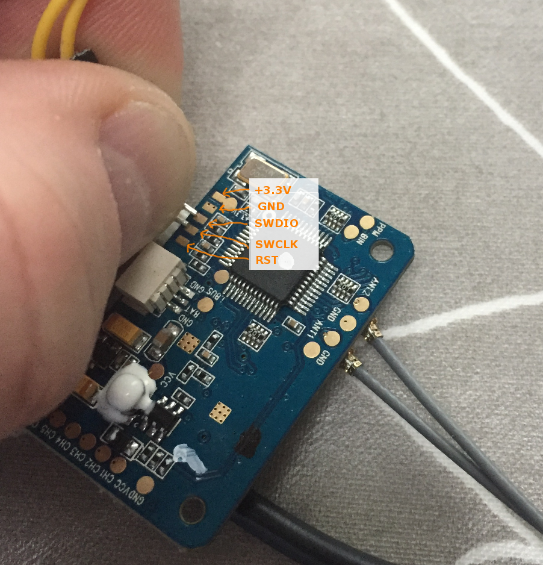
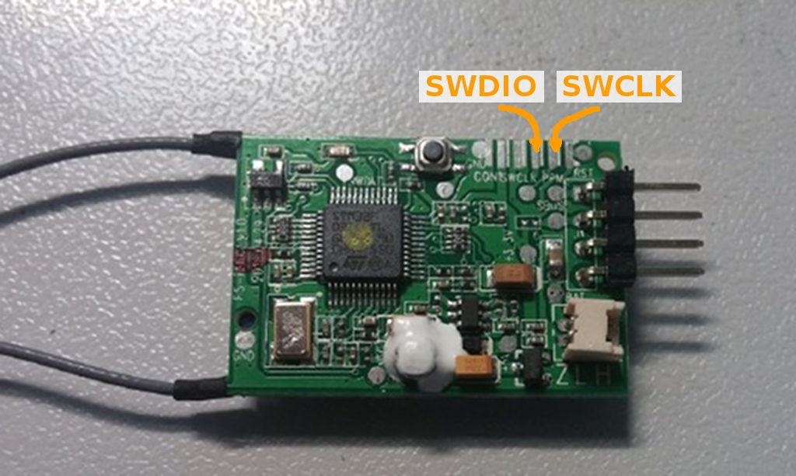
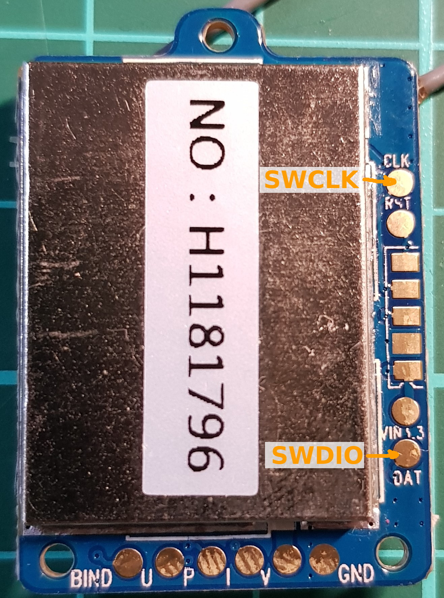
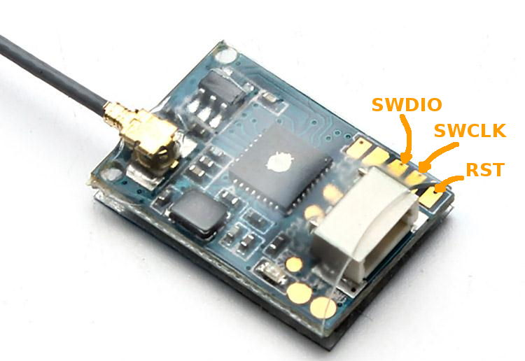
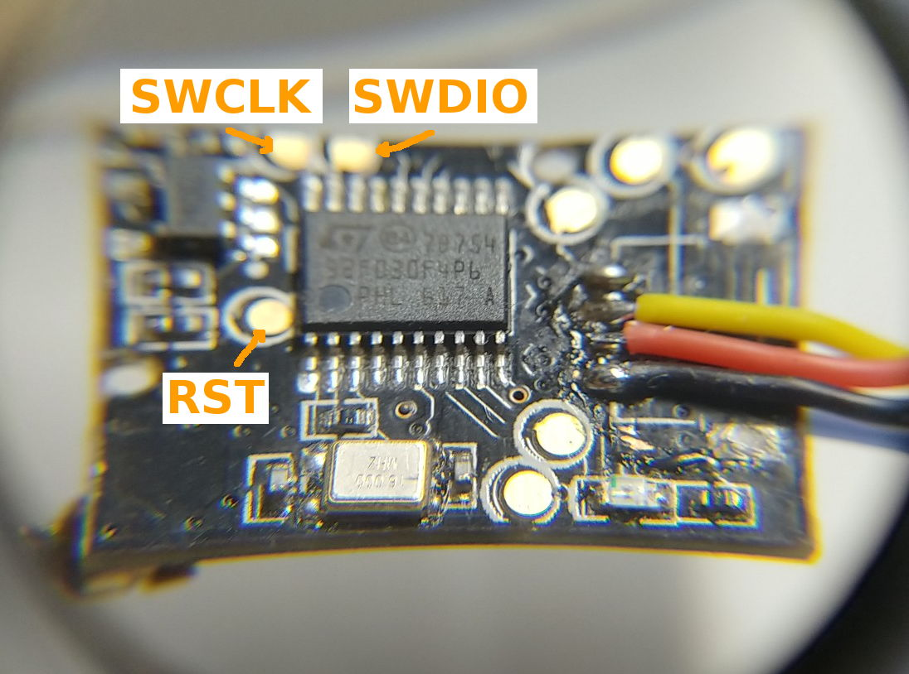
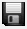

# How to upgrade Flysky / Turnigy Receiver firmware
(Based on work from Goebish who did the first iA6B upgrade instructions)

Use this procedure at your own risk 

A requirement for this procedure is the ST-Link V2 debugging stick. It is available for cheap on eBay og banggood ()

This procedure will allow you to install new firmware on most FlySky Receivers. The Receivers are all powred by an STM32 chip, and for some receivers there are different firmware releases.

The FS-i10 can update some/all receivers (?) over the air. But I do not have the FS-i10.

If you want to support me, please click this affiliate link when going to shop at Banggood - It is free for you, but I will get some money from banggood: 
https://www.banggood.com/?p=9O2015638249201406IM

## Firmware releases
* iA6B: Version 1.6 - Firmware with 8 channel PPM output (first had 6 channels only)
* iA6C: Version x.x - Just a dump from a Turnigy iA6C receiver
* X6B: Version x.x - This is a firmware confirmed working with failsafe on iBus (BetaFlight/iNav). There have been some reports on receivers which just did channel hold on iBus/PPM, and only working failsafe on PWM. If you have one of these defective receivers, you should update.
* iA8X
* X8B
* A8S: Version 2
* 8A: Version 2 (probably A8S clone)

If you want firmware with the true receiver RSSI on iBus channel 8 or 4, then please download the firmware from Clerics repository rather than mine.
https://github.com/Cleric-K/FlySkyRxFirmwareRssiMod

## Instructions
Download and install ST-Link driver:
http://www.st.com/content/st_com/en/products/embedded-software/development-tool-software/stsw-link009.html#getsoftware-scroll

Download ST-Link Utility:
http://www.st.com/content/st_com/en/products/embedded-software/development-tool-software/stsw-link004.html#getsoftware-scroll

Connect the iA6B to the ST-Link:
- connect a gnd pin of the receiver to gnd on the ST-Link. Power the RX with 5V - You can use the 5V from the ST-Link, or another source.
- solder wires to CLK & DAT pads inside the RX then connect them to the ST-Link SWCLK & SWDIO pins. Some people prefers to press pins to the pads instead of soldering. It takes a bit of practice, but should be safe since the bootloader is in ROM, and is not overwritten.

X6B: 

iA6B: 

iA6C: 

iA8X: 

X8B: 

A8S: 

8A: 

### Making a backup
* Launch ST-Link Utility
* Set the Address field to 0x08000000 and Size to 0x8000
* Click Connect to the target
* Click Save () to keep a backup of your firmware, just in case ...

### Flashing new firmware

* Download the firmware from https://github.com/povlhp/FlySkyRxFirmware
optional: open it in an hex editor then change the 4 bytes at offset 0x1C00 (12 34 56 78) to change RX ID, I think you can use any arbitrary values, just avoid using FF FF FF FF. If you do not do this, your receivers might have same ID; and be bound at same time.
I recommend using the ID from the old firmware.
* Click open (
) then select the new firmware file
* Click Program Verify (), check that start address and file path are correct, then click start. I had to select verify after programming.
* Click Disconnect ()

### Verify
Rebind the RX to Deviation
You should now see RSSI in dB in telemetry monitor screen (~ -60d)
Verify reported voltage levels are correct. The iA6C firmware on X6B has some pins swapped, and wrong reporting.

